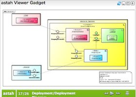

# astah Viewer - OpenSocial Gadget
[astah(旧JUDE)製品](http://astah.change-vision.com/)で作られた設計情報を見るためのOpenSocial Gadgetです。

astah Viewerを使うことで、[astah](http://astah.change-vision.com/)で描かれたUML、ER図、データフロー図、フローチャート、CRUD、要求図、マインドマップをOpenSocial対応インフラ上で見ることができます。

## Gadget URL
[http://f.air-life.net/apps/gadgets/astah/astah-gadget.xml](http://f.air-life.net/apps/gadgets/astah/astah-gadget.xml)

## 使い方
1. astah ViewerをinfoScoopやiGoogleなどのガジェットとして追加する
2. [astah(旧JUDE)製品](http://astah.change-vision.com/)で作られた.asta/.judeファイルを[astah publish](http://p.astah.net/about)で公開する
3. ガジェット設定のastah URLに.asta/.judeファイルのURLを入力する[例: http://p.astah.net/a/dademo]

## License
Apache License, Version 2.0